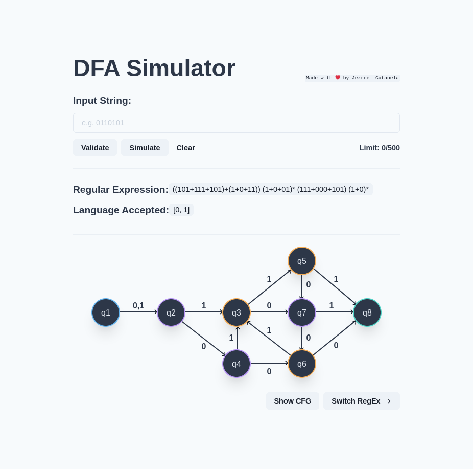
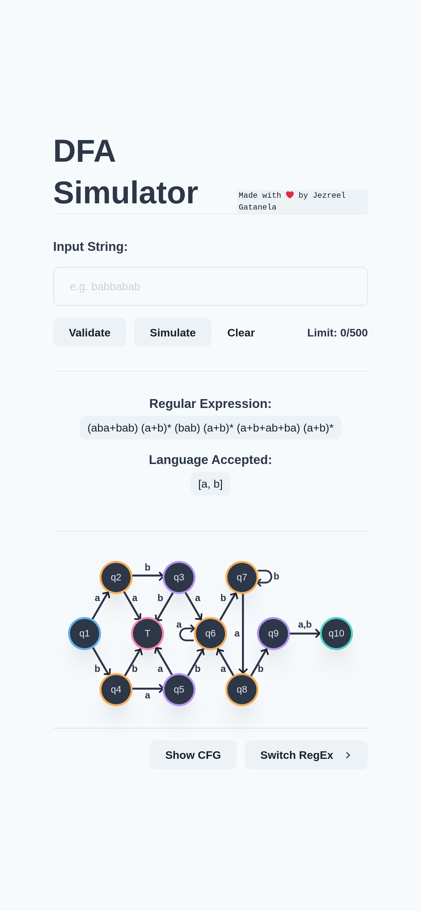

# DFA Simulator
A **React** application for Deterministic Finite Automaton (DFA) simulation.
- Deployed with [Vercel](https://vercel.com/solutions/nextjs)

## Framework and Libraries used
- Chakra UI
- Framer Motion
- Next.js

## Preview
### Main page

### 2nd Regular Expression

### Half Screen

### Mobile

